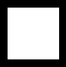
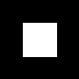

# Your first deep neural network in less than 5 minutes.

**Big picture**:  Train a neural net with the keras framwork to classify images of circles and squares :

         

**The goal**: Train the net to classify with an accuracy of 100%.


## Step 1 Installation

* [Installation] (https://github.com/mashgin/basic_deep_learning_keras/blob/master/installation.md)

* `git clone https://github.com/mashgin/basic_deep_learning_keras.git` 


## Step 2 Train

* `python -U keras_train.py t`


## Step 3 Classify

* `python -U keras_train.py c` ('q' to quit out of it)

## Understanding


### Training 

Create our data :
```python
if cls == 0:
		cv2.circle(img, (n_cols/2, n_rows/2), random.randint(10, n_cols/2 - 10), (255), -1)
elif cls == 1:
		side = random.randint(10, n_cols/2 - 10)
		cv2.rectangle(img, (n_cols/2 - side, n_cols/2 - side), (n_cols/2 + side, n_cols/2 + side), (255), -1)
```
Train our network with this data:

```python
model.train_on_batch(imgs_train, label_train)
```
### Testing

Every couple iterations test our net:

```python
score = model.test_on_batch(imgs_test, labels_test)
print  "Accuracy:{0:.0f}%\n".format( score[1]*100)
```

### The Net 

Here we initialize our neural net :

```
model = Sequential()
```

Then we just `.add` the layers we want to define our neural net architecture.

```
	model.add(Convolution2D(16, 5, 5, border_mode='valid', input_shape=(n_rows, n_cols, 1)))
	model.add(Activation('relu'))
	model.add(MaxPooling2D(pool_size=(2,2)))
	model.add(Convolution2D(32, 5, 5))
	model.add(Activation('relu'))
	model.add(MaxPooling2D(pool_size=(2,2)))
	model.add(Dropout(0.25))

	model.add(Flatten())
	model.add(Dense(128))
	model.add(Activation('relu'))
	model.add(Dropout(0.5))
	model.add(Dense(n_classes))
	model.add(Activation('softmax'))
```

A basic description of the layers:

* Convolution2d → extracting local image information 
* Activation → evaluate information relevance
* MaxPooling2D → image compression
* Dropout → avoiding bias
* Flatten → reformat  
* Dense → evaluate global image information (fully connected layer)


And last but not least this defines how our network should learn, which we use when training: 

```
	model.compile(loss='categorical_crossentropy', optimizer='adam', metrics=['accuracy'])
```


 
 
